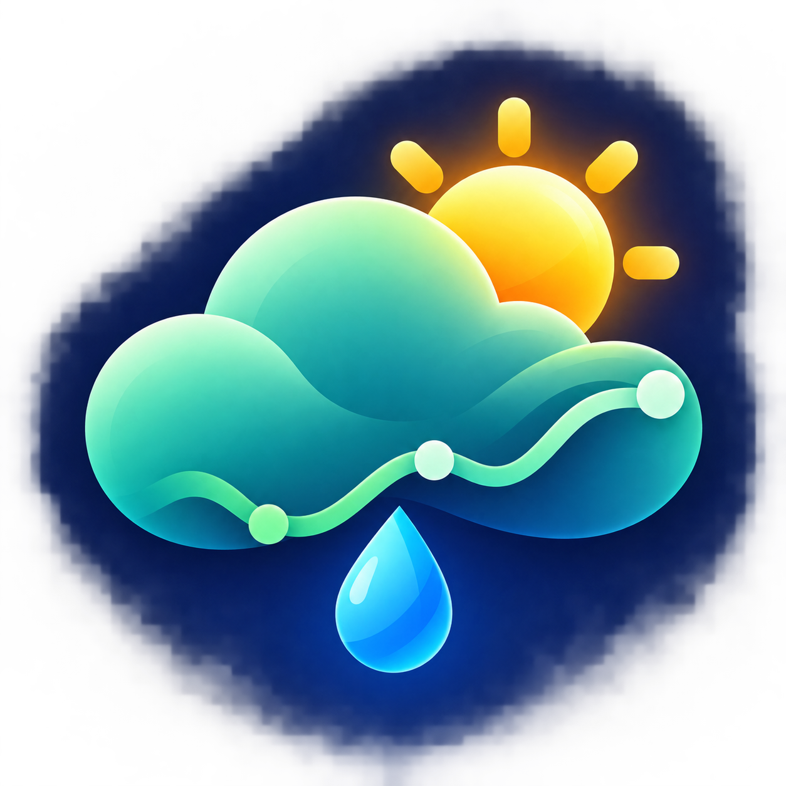
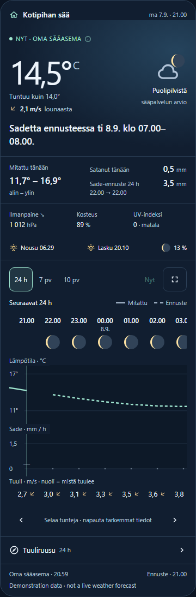
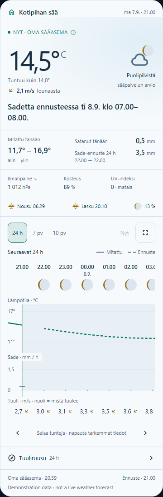

<p align="center"></p>

# Amazing Weather Card

**Your weather station, its history and the forecast — in one Home Assistant card.**

[](https://github.com/raunosr/ha-amazing-weather-card/releases/latest)
[](https://github.com/raunosr/ha-amazing-weather-card/actions/workflows/ci.yml)
[](https://github.com/raunosr/ha-amazing-weather-card/actions/workflows/hacs.yml)
[](https://www.hacs.xyz/docs/faq/custom_repositories/)
[](LICENSE)

[Suomenkielinen asennusohje](docs/ASENNUS.md) · [Configuration](docs/configuration.md) · [How the data works](docs/data-and-design.md) · [Changelog](CHANGELOG.md)

See what it feels like outside, what has actually happened in your garden, and what is coming next. Designed for the whole family, with more detail one tap away.

<p align="center">
  
  
</p>

Screenshots show the actual card running with demonstration data, not a live weather forecast.

## Features

- **Current weather at a glance:** outdoor and feels-like temperature, wind direction and speed, a short forecast summary and a gently animated weather icon.
- **One place for today's facts:** measured low/high, rain so far, forecast rainfall with its actual period, pressure trend, humidity and UV index.
- **24 hours, 7 days or 10 days:** swipe or drag the chart, use its arrow buttons, or expand it. Hourly temperature and rain share a timeline; wind appears as a number and a small direction arrow. Daily views keep each day separate.
- **Measurements stay distinguishable:** a solid temperature line for station history, a dashed line for the forecast, explicit missing values and source/update information.
- **A wind rose on demand:** time-weighted measured directions and speed ranges, current direction and recording coverage.
- **Sun and moon:** local sunrise/sunset, calculated moon phase and illumination, with more astronomy details on tap.
- **Light/dark themes, Finnish/English, visual configuration**, keyboard controls and reduced-motion support.
- **Optional wall display mode:** returns to Now after inactivity. Personal mode leaves the chart where you put it.
- **One bundled file:** no extra card dependencies, external fonts, CDN requests, analytics or API keys. Uses your existing Home Assistant weather integration.

## Install with HACS

This repository is installable as a **HACS custom repository**. It is not currently included in HACS's default searchable catalogue.

1. In HACS, open **⋮ → Custom repositories**.
2. Add `https://github.com/raunosr/ha-amazing-weather-card` and select **Dashboard** as its type.
3. Find **Amazing Weather Card**, download it, then reload the browser or Companion App frontend.
4. Edit your dashboard, choose **Add card → Amazing Weather Card**, and select a weather entity. Add your station sensors in the visual editor.

If the card does not appear, check **Settings → Dashboards → Resources** (advanced mode may be needed). There should be exactly one **JavaScript Module** resource with this URL:

```text
/hacsfiles/ha-amazing-weather-card/ha-amazing-weather-card.js
```

For a dashboard whose resources are managed in YAML:

```yaml
resources:
  - url: /hacsfiles/ha-amazing-weather-card/ha-amazing-weather-card.js
    type: module
```

HACS handles future updates. Reload the frontend after updating. See the [official custom repository instructions](https://www.hacs.xyz/docs/faq/custom_repositories/) if the HACS menu differs in your version.

## Quick configuration

Only a weather entity is required. Replace the example ID with one from your Home Assistant:

```yaml
type: custom:ha-amazing-weather-card
entity: weather.home
```

Add your own station readings to combine observations with the forecast:

```yaml
type: custom:ha-amazing-weather-card
entity: weather.home
name: Weather at home
temperature_entity: sensor.outdoor_temperature
feels_like_entity: sensor.feels_like
humidity_entity: sensor.outdoor_humidity
pressure_entity: sensor.air_pressure
uv_entity: sensor.uv_index
wind_speed_entity: sensor.wind_speed
wind_gust_entity: sensor.wind_gust
wind_direction_entity: sensor.wind_direction
rain_today_entity: sensor.rain_today
# Optional, preferred for hourly rainfall when available:
rain_total_entity: sensor.rain_total
```

All sensor IDs above are placeholders. Remove any option for a sensor you do not have. A configured sensor that becomes unavailable is shown as missing; it is not silently replaced by a weather service estimate.

See [all configuration options](docs/configuration.md), including language, themes, temperature units, wall mode and location overrides.

## Requirements and data availability

- Home Assistant **2024.6 or newer** is the declared API baseline. Use a current browser or Companion App webview with native dialog and container-query support.
- A `weather.*` entity supporting **hourly and/or daily forecasts**. The card subscribes to Home Assistant's forecast API; it does not depend on the old `forecast` state attribute.
- Ten days are shown only when the provider supplies ten days. Shorter forecasts are labelled with their actual available length. Twice-daily-only forecasts are not supported in this release.
- Optional `sensor.*` entities with their proper units, and **recorder history** for measured charts, daily extrema, pressure trends and the wind rose. No extra integration is required for astronomy.
- This first release has automated data and browser tests against a simulated Home Assistant interface. **It has not yet been verified against a live Home Assistant installation.** Provider-specific behaviour and the real HACS installation path still need field validation.

## Manual installation

Download `ha-amazing-weather-card.js` from the [latest release](https://github.com/raunosr/ha-amazing-weather-card/releases/latest), copy it to `config/www/ha-amazing-weather-card.js`, and add `/local/ha-amazing-weather-card.js` as a **JavaScript Module** dashboard resource. Reload the frontend. Use either this resource or the HACS one, not both.

## Troubleshooting

| Symptom                          | Check                                                                                                                            |
| -------------------------------- | -------------------------------------------------------------------------------------------------------------------------------- |
| “Custom element doesn't exist”   | Verify the resource URL and module type, remove duplicates, then hard reload.                                                    |
| No hourly/daily forecast         | Check that your weather integration supports that forecast type. Subscription failures retry automatically.                      |
| No measured history or wind rose | Select the required sensors; check recorder exclusions, history retention and the signed-in user's access.                       |
| A reading shows `—`              | The selected entity, its value or its measurement unit is missing/unsupported. Tap measurement details.                          |
| A stable sensor is marked old    | Some sensors report only on changes. Increase `stale_after`, or set it to `0` to disable the age heuristic.                      |
| Rain differs from another chart  | Confirm whether its sensor is a daily counter, lifetime counter or rain rate. This card expects accumulation in mm/in, not mm/h. |

## Development

```sh
npm ci
npm run dev
```

Open `http://127.0.0.1:5278/demo/`. The demo includes normal, unavailable, zero-value, missing-rain, short-forecast, daily-only, imperial-unit and connection-error scenarios. It uses no credentials or external weather requests.

```sh
npm run check
npx playwright install chromium
npm run test:browser
```

The release bundle is `dist/ha-amazing-weather-card.js`. Source is TypeScript with Lit; chart graphics are SVG, astronomy uses bundled SunCalc. See [contributing](CONTRIBUTING.md) and [third-party notices](THIRD_PARTY_NOTICES.md).

MIT licensed. An independent community project; not affiliated with Home Assistant or HACS. [Icon provenance](docs/branding.md).
